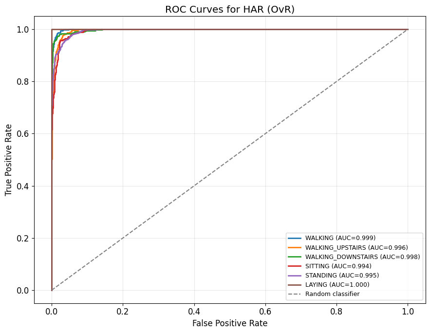

# Gradient boosting

Recognising what a person is doing from the accelerometer and gyroscope of a phone in their
pocket.

## Data

The UCI Human Activity Recognition dataset, 7 352 training and 2 947 test windows, each
described by 561 features already derived from the raw signals, labelled with one of six
activities: walking, walking upstairs, walking downstairs, sitting, standing and laying.

## Method

`HistGradientBoostingClassifier`, the histogram-based implementation in scikit-learn, which
buckets continuous features before searching for splits and so trains in a fraction of the
time of the exact algorithm. Three hundred boosting stages at a learning rate of 0.07, a
conservative step chosen to keep the ensemble from overfitting a dataset of this size.

## Results

| Metric | Value |
|--------|------:|
| Accuracy | 0.938 |
| Precision, macro | 0.940 |
| Recall, macro | 0.936 |
| F1, macro | 0.937 |

*One-vs-rest ROC curve for each activity.*

All four numbers sit within half a point of each other, and since the macro averages weigh
every activity equally, that agreement says the model is not carrying its score on the easy
classes. The per-class curves show where the remaining error lives: laying is perfect at
1.000 and the three walking variants sit at 0.996 and above, while sitting at 0.994 and
standing at 0.995 are the hardest pair, which is what the sensors predict, since a phone
reports nearly the same orientation and nearly no motion in both.
