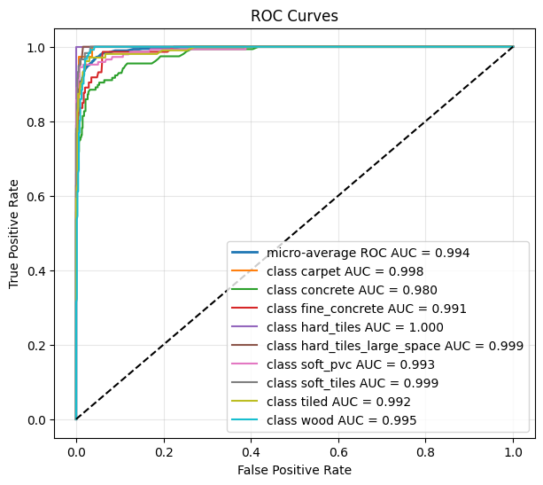

# Random forest

Recognising the surface a robot is driving over from its inertial sensors, a nine-class
problem on badly unbalanced data.

## Data

3 810 measurements described by 25 features, labelled with the floor type underneath:
concrete, soft PVC, wood, tiles, fine concrete, hard tiles, carpet and the rest. The classes
are far from even, from 779 examples of concrete down to 21 of hard tiles, which is what
makes the macro-averaged scores the only fair ones to quote.

## Method

A random forest, with the depth of the trees chosen on a validation split rather than
assumed. Four depths were tried and scored by macro F1.

| max_depth | F1, macro |
|----------:|----------:|
| 5 | 0.572 |
| 10 | 0.860 |
| 15 | 0.920 |
| 20 | 0.920 |

## Results

The curve flattens between 15 and 20, so the deeper forest is not buying anything, and 20 is
taken as the final model.

| Metric | Value |
|--------|------:|
| Accuracy | 0.911 |
| Precision, macro | 0.926 |
| Recall, macro | 0.916 |
| F1, macro | 0.920 |

*One-vs-rest ROC per surface, with the micro-average at 0.994. Concrete is the hardest class
at 0.980 despite being the most common one, and hard tiles reach 1.000 on 21 examples, which
is a number to treat with suspicion rather than pride.*

Macro precision and recall come out above the plain accuracy, which is the sign that the
forest is not simply riding the large classes and dropping the rare ones.
