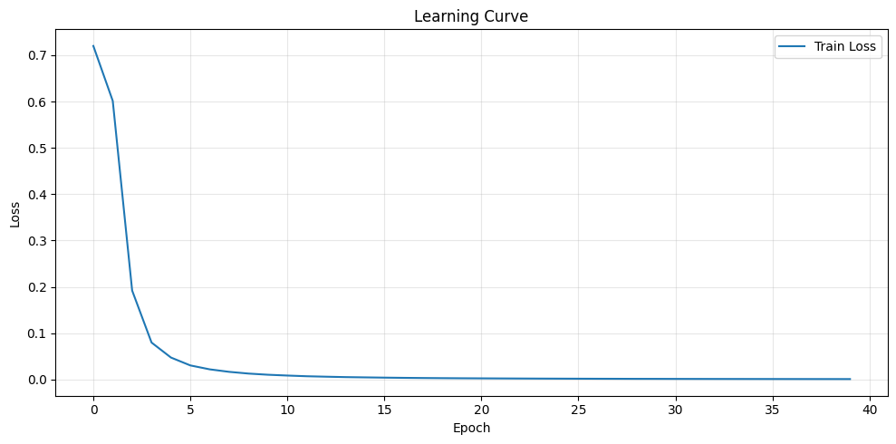
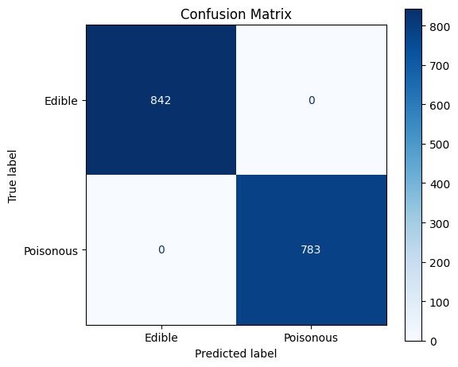
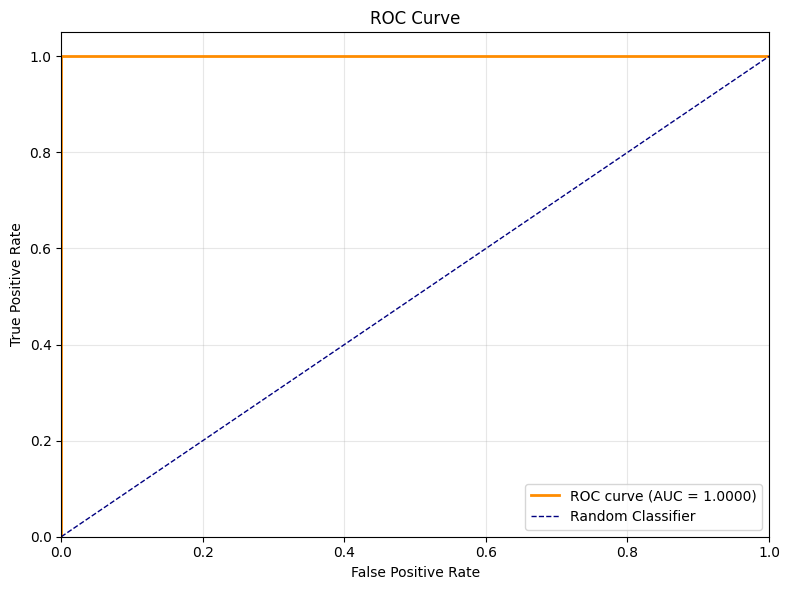

# Multilayer perceptron

Telling edible mushrooms from poisonous ones, the textbook example of a problem that looks
hard and is not.

## Data

The UCI mushroom dataset, 8 124 specimens described by 22 categorical attributes of the cap,
gills, stalk, spores and habitat, each labelled edible or poisonous.

## Method

A network with two hidden layers of 64 and 32 units and logistic activations, trained on a
standard split after the categorical attributes are encoded.

## Results

| Metric | Value |
|--------|------:|
| Accuracy | 1.000 |
| Precision | 1.000 |
| Recall | 1.000 |
| F1 | 1.000 |
| ROC AUC | 1.000 |

*Training loss by epoch. The network is essentially done after five epochs.*

*Not a single misclassification on the test set, so the ROC curve is the degenerate one
through the top left corner.*

A perfect score is a result about the dataset, not about the network. The attributes contain
features, odour above all, that separate the two classes almost by themselves, so the
interesting question here is not how well a model can do but how little model the problem
actually needs.
