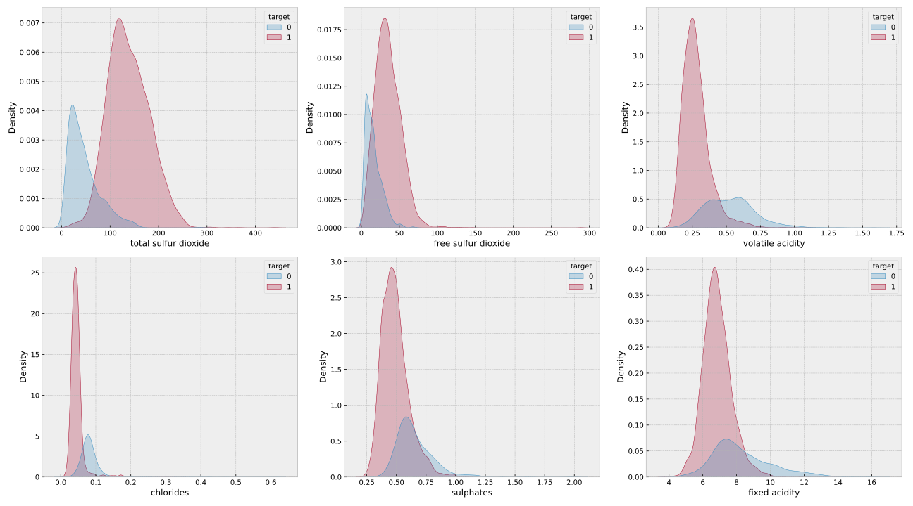
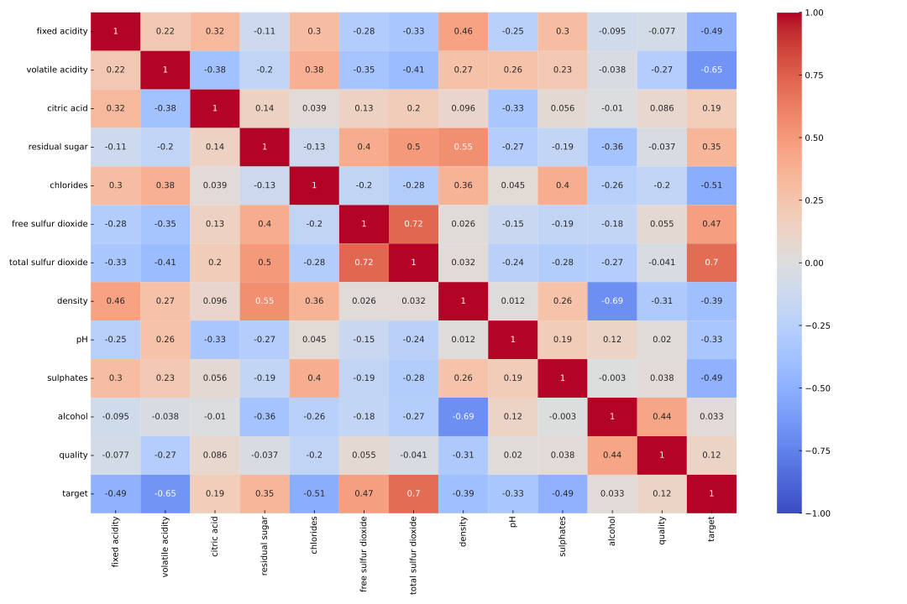
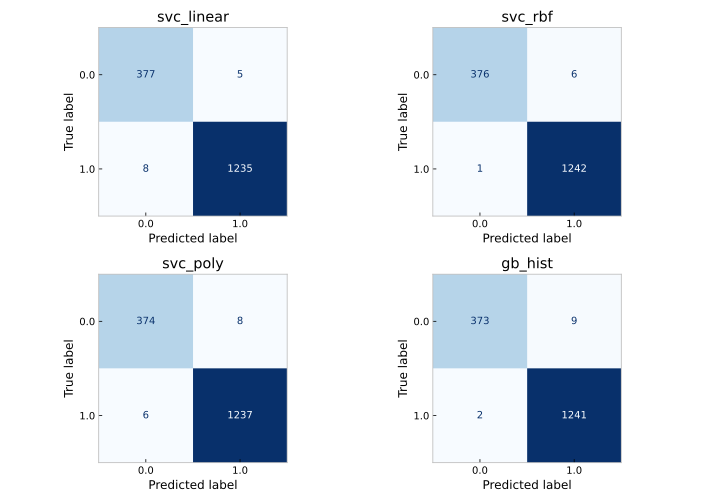
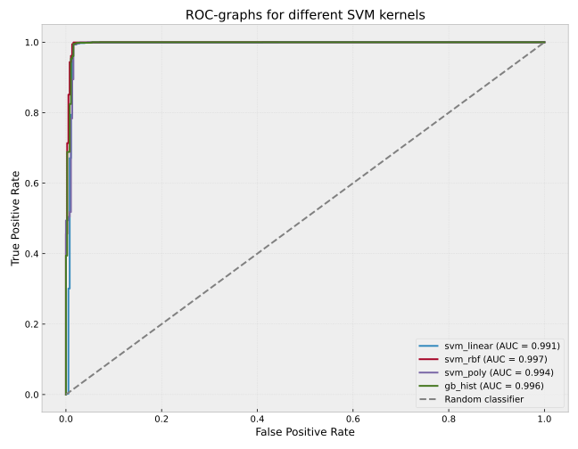

# Coursework: telling red wine from white

Four models put against each other on one dataset, with a written report covering the theory,
the exploratory analysis and the results.

## Data

The Wine Quality dataset, the physico-chemical measurements of Portuguese Vinho Verde, red
and white subsets combined into one table with the variety as the target.

## Exploratory analysis

*Distribution of each feature by variety.*

*Correlations between the features.*

## Models

Support vector machines with three kernels, linear, polynomial and RBF, against
`HistGradientBoosting` as the boosting representative.

| Model | Accuracy | Precision | Recall | F1 | ROC AUC |
|-------|---------:|----------:|-------:|---:|--------:|
| RBF SVM | 0.9957 | 0.9952 | 0.9992 | 0.9972 | 0.9971 |
| Hist Gradient Boosting | 0.9932 | 0.9928 | 0.9984 | 0.9956 | 0.9960 |
| Linear SVM | 0.9920 | 0.9960 | 0.9936 | 0.9948 | 0.9911 |
| Polynomial SVM | 0.9914 | 0.9936 | 0.9952 | 0.9944 | 0.9936 |

*Confusion matrices for the four models.*

*ROC curves. All four hug the top left corner, which is why the table above is decided in
the fourth decimal place.*

## What the numbers say

Every model clears 0.99 accuracy, which says more about the data than about the models: red
and white wine are cleanly separable by their chemistry. The RBF kernel comes out first,
confirming that a non-linear boundary suits the problem, and boosting takes second place
with no tuning to speak of.

Linear and polynomial SVM finish level with each other but differ in character, the linear
one being the more precise and the polynomial one the more complete, which is the usual
trade a decision boundary makes. The features carrying most of the signal are total sulfur
dioxide, volatile acidity and chlorides.

The full report is in [`report/report.pdf`](report/report.pdf).
