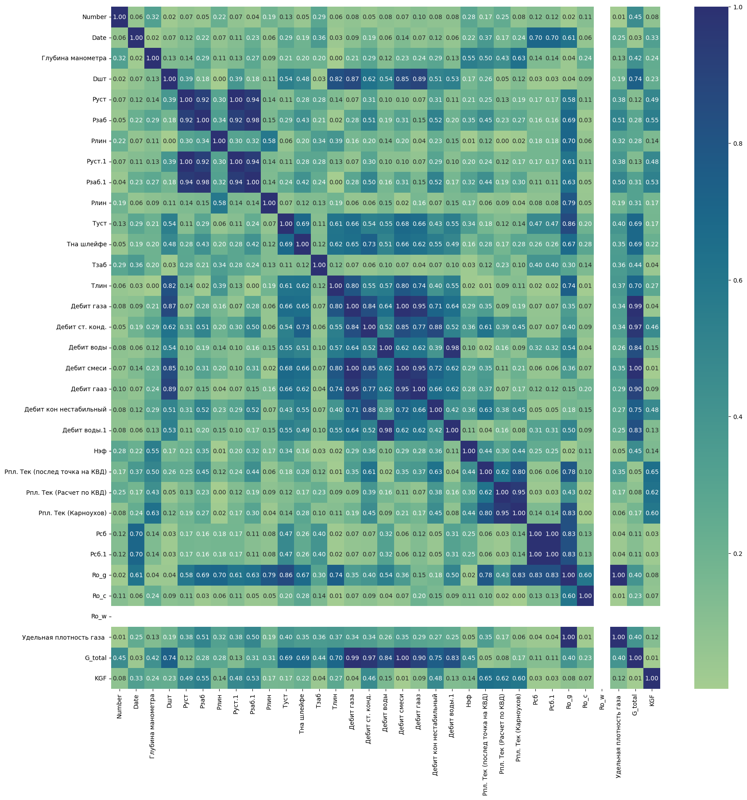
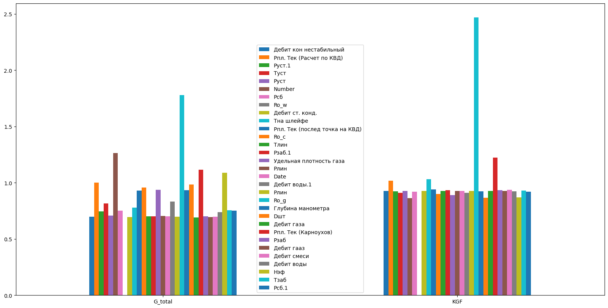

# Exploratory analysis

Feature selection done from information theory rather than from a library call, on
measurements from oil wells: pressures, depths, choke diameters and the rest.

The notebook implements entropy, information gain and split information by hand, and applies
them to the multi-valued columns. Entropy measures how mixed a column is, information gain
measures how much of that mixing a feature removes, and split information is the correction
that stops the measure from favouring a feature simply for having many distinct values,
which is the failure mode plain information gain is known for.

*Correlations across the whole table. The blocks of near-unit correlation are the duplicated
measurements, pressures recorded twice and flow rates derived from each other, which is
exactly what the information-theoretic measures are meant to catch.*

*Information gain by column.* The pairwise scatter plots are in
[`figures/pairplot.png`](figures/pairplot.png), left as a file because of its height.

The result is a ranking of the columns by how much they actually tell about the target,
which is the input to any modelling that follows.
